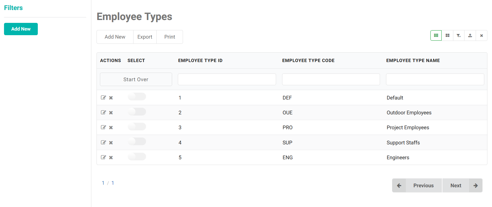
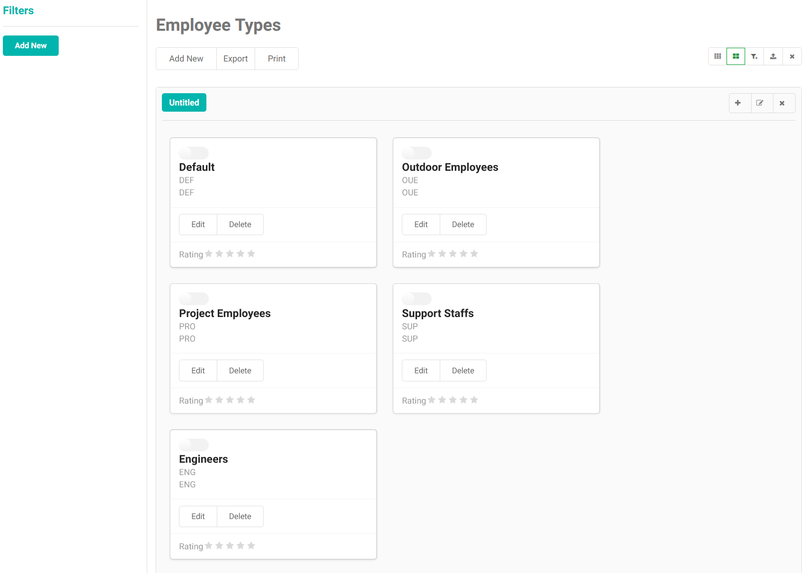
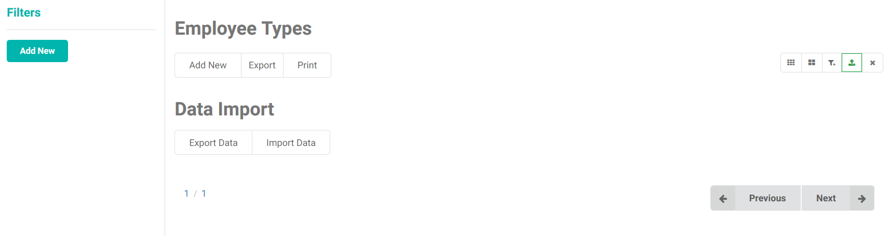
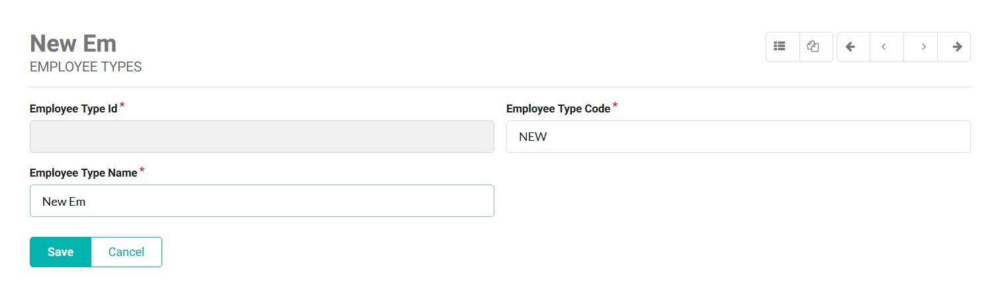

# ScrudFactory

ScrudFactory enables rapid application development (RAD) by consuming [Frapid Resultful API](restful-api.md) and automatically producing the user interface for performing SCRUD operation.

**Tasks**

- Display a Grid View Layout
- Display a Kanban Card Layout
- Perform a Filtered Search on Grid View
- Manage Named Filters
- Adding a New Record
- Editing a Record
- Delete a Record
- Data Validation
- Navigating through Records
- Data Import and Export
- and much more

## Usage

Create a couple of DIVs to contain ScrudFactory View and Form.

```html
<div id="ScrudFactoryForm"></div>
<div id="ScrudFactoryView"></div>
```

Initializing ScrudFactory in JavaScript is very simple and straightforward.

```javascript
<script>
	var scrudFactory = new Object();
    scrudFactory.title = window.translate("EmployeeTypes");

    scrudFactory.viewAPI = "/api/views/hrm/employee-type-scrud-view";//Restful API
    scrudFactory.viewTableName = "hrm.employee_type_scrud_view";

    scrudFactory.formAPI = "/api/forms/hrm/employee-types";//Resultful API
    scrudFactory.formTableName = "hrm.employee_types";

    scrudFactory.allowDelete = true;
    scrudFactory.allowEdit = true;
    scrudFactory.excludedColumns = ["AuditUserId", "AuditTs", "Deleted"];//Do not show these columns on grid


    scrudFactory.live = "EmployeeTypeName";//Updates the title as you type in this field.

//The column names to be displayed on the card sections. If you omit this variable, ScrudFactory will try to figure out the sections automatically.
    scrudFactory.card = {
        header: "EmployeeTypeName",
        description: "EmployeeTypeCode"
    }; 


    $.get('/ScrudFactory/View.html', function (view) {
        $.get('/ScrudFactory/Form.html', function (form) {

            $("#ScrudFactoryView").html(view);
            $("#ScrudFactoryForm").html(form);
          
            $.cachedScript("/assets/js/scrudfactory-view.js");
            $.cachedScript("/assets/js/scrudfactory-form.js");
        });
    });
</script>
```

## Grid View Layout



## Kanban (Card) Layout



## Data Import



## ScrudFactory Form




Ask questions in [MixERP Forums](https://mixerp.org/forums) if you have an idea on how to make ScrudFactory better.

[Back to Internationalization](i18n.md)

