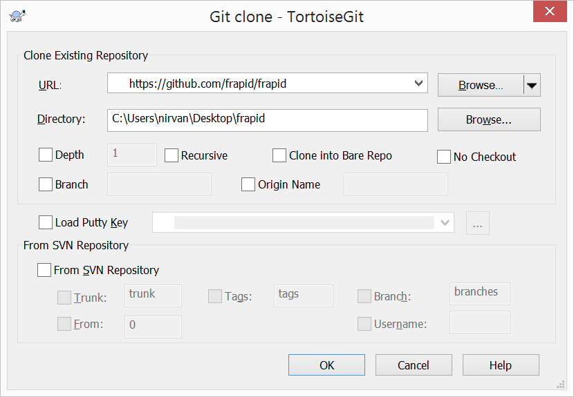

# Installing Frapid

Before you begin reading this document, throw your pillows off and get these tools installed on your PC first:

* [Visual Studio 2015 Community](http://visualstudio.com)
* [PostgreSQL Server 9.3+](http://postgresql.org) or [SQL Server 2014+](https://www.microsoft.com/en-us/sql-server/sql-server-2016)
* [Git for Windows](http://git-scm.com)
* [TortoiseGit (if you want a nice Git GUI)](https://tortoisegit.org/download/)

Once you have all of the above, you're good to go.

## Learn to Use Git

**Please do not download github repository as a ZIP file**.
Use git to clone frapid.

**Using Git (Optional)**

Run Git Bash console application.

```git
mkdir frapid
cd frapid
git clone https://github.com/frapid/frapid

```

**OR**

**Tortoise Git (Optional)**

* Using Windows Explorer, navigate to the directory where you want to keep frapid source codes on.
* Right mouse click and then click **Git Clone**.
* On the URL field, type `https://github.com/frapid/frapid`.
* Click OK.



Once you finish this step, you have a local frapid git repository on your hard drive.

## Rename "_Config" Directory

Rename (or copy) the directory `~/Resources/_Config` to `~/Resources/Config`.


## Conventions and Configurations

Configuration enables you to customize application behaviors whereas convention 
forces you to follow and keep track of things. Frapid uses the best of both worlds.

### Master Configuration

The root directory of frapid web application is:

`~/src/Frapid.Web`

The master configuration files are available on the `~/Resources/Configs` directory.

|File Name                                | Description              |
|-----------------------------------------|--------------------------|
| [DomainsApproved.json](../configs/DomainsApproved.json.md) | Contains list of approved DNS domain names which will be served by Frapid. |
| [DomainsInstalled.json](../configs/DomainsInstalled.json.md) | Contains list of installed DNS domain names. This file should not be edited manually. |
| [JwtConfig.json](../configs/JwtConfig.json.md) | Contains configuration related to Json Web Tokens. |
| [Parameters.config](../configs/Parameters.config.md) | Contains standard application configuration data.|
| [PostgreSQL.config](../configs/PostgreSQL.config.md)   | Contains configuration realted your PostgreSQL server. |
| RblServers.config | Contains list of RBL (DNS Blacklist) Servers.|
| RedisConfig.json | Contains Redis server configuration. |
| [SQLServer.config](../configs/SQLServer.config.md)   | Contains configuration realted your SQL Server. |


**You must be fairly familiar with the master configuration files before you proceed to the next steps.**


### Instance Configuration (Convention)

Configuration in frapid is instance-aware. It is, therefore, safe to assume that configuration of **foo.com**
does not affect **bar.com**.

[By convention](../concepts/database-naming-convention.md), the configuration files for **foo.com** would be located on:

`~/Tenants/foo_com/Configs`

#### Instance Directories

|File Name                                | Description              |
|-----------------------------------------|--------------------------|
| Areas | Contains module specific configuration and [overrides](../developer/overrides.md) for `foo_com` instance. |
| Attachments | Attachments (uploads) of `foo_com` instance. |
| Backups | Backups of `foo_com` instance | 
| Configs | Configuration files related to `foo_com` instance. More on this topic is discussed below. |
| Documents | Documents related to `foo_com` instance. |

### Instance-Specific Application Configuration Files

|File Name                                | Description              |
|-----------------------------------------|--------------------------|
| [Applications.config](../configs/Applications.config.md) | Contains configuration of frapid applications related to `foo_com` instance. |
| [SMTP\SendGrid.json](../configs/SendGrid.json.md) | Contains configuration of [SendGrid Transactional Email Service](http://sendgrid.com) related to `foo_com` instance.
| [SMTP\Mailgun.json](../configs/Mailgun.json.md) | Contains configuration of [Mailgun Transactional Email Service](http://mailgun.com) related to `foo_com` instance.


### Website Themes

By convention, website themes would be found on:

`~/Tenants/foo_com/Areas/Frapid.WebsiteBuilder/Themes/<ThemeName>`

Read more on the chapter [Creating Website Themes](../developer/website-builder/theme.md).

## Create IIS Application

Now that you have gone through this document completely, 
you now have a proper understanding of what's going under the hoods.

Please follow the [IIS Installation Guide](iis.md) to install frapid on your development machine.

[Return Back](../../README.md)
