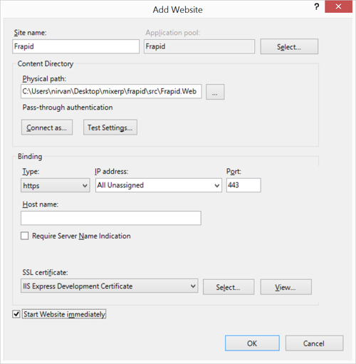

# Installing Frapid on IIS

This document assumes that :

* you have already installed PostgreSQL Server 9.3 or above and have password for `postgres` user handy.
* you have cloned frapid github repository locally.
* you have understood the [installation basics](README.md).

Open IIS and create a new website as shown in this image.

| Field                         | Description                                                                           |
|-------------------------------|---------------------------------------------------------------------------------------|
| Site name                     | The website name.                                                                     |
| Application pool              | Will be automatically created.                                                        |
| Physical path                 | `~/src/Frapid.Web`                                                                    |
| Binding->Type                 | https (Frapid works with HTTPS only)                                                  |
| IP address                    | All unassigned.                                                                       |
| Port                          | Leave this to 443.                                                                    |
| Host name                     | Empty                                                                                 |
| SSL certificate               | Select IIS Express Development Certificate or whatever applicable in your case.       |

Click Ok.

## Directory Permission

Provide the following users write access to the directory `~/src/Frapid.Web`:

* IIS AppPool\frapid (or IIS AppPool\yoursitename).
* Authenticated Users (or Usuarios autenticados or utilisateurs authentifiés)

## Build Frapid

Open the frapid solutions in the mentioned order and perform a build:

* ~/src/Frapid.Web.sln
* ~/src/Frapid.Web/Areas/Frapid.Dashboard/Frapid.Dashboard.sln
* ~/src/Frapid.Web/Areas/Frapid.Config/Frapid.Config.sln
* ~/src/Frapid.Web/Areas/Frapid.Core/Frapid.Core.sln
* ~/src/Frapid.Web/Areas/Frapid.WebsiteBuilder/Frapid.WebsiteBuilder.sln
* ~/src/Frapid.Web/Areas/Frapid.Account/Frapid.Account.sln

Alternatively, you can also build frapid by running this batch file:

* ~/builds/all.bat

## Edit DbServer.config

Edit the configuration files:

* [PostgreSQL.config](../configs/PostgreSQL.config.md) or [SQLServer.config](../configs/SQLServer.config.md) (ideally both) for database access.
* [DomainsApproved.json](../configs/DomainsApproved.json.md) and change the "AdminEmail" for localhost domain to your own email address.

## Browse Frapid

Browse frapid on this URL : [https://localhost/install](https://localhost/install) and confirm SSL certificate exception. Wait a few minutes for the installation to complete. Reload the page.
You will notice that a database name "localhost" has been automatically created and populated for you.

## Configure Email Provider

Since you still do not have access to the admin area, you need to create an account for yourself. To verify your account, frapid will send account verification email.
You need to configure a transactional email provider.

- Create an account with [SendGrid](http://sendgrid.com/) and edit the configuration file `~/Tenants/localhost/Configs/SMTP/SendGrid.json`.
- Or create an account with [SparkPost](https://www.sparkpost.com/) and edit the configuration file `~/Tenants/localhost/Configs/SMTP/SparkPost.json`.
* Enter from email.
* Enter API User.
* Enter API Key.
* Set Enabled to true.

## Sign Up

Navigate to the [sign up page](https://localhost/account/sign-up) and create an account for yourself. Verify your account and login to the admin area.

## Troubleshooting Installation Issues

If you encounter installation issues, examine log files on [C:\frapid-logs](../configs/Parameters.config.md). If you want start over once again:

* delete the database "localhost".
* delete the directory ~/Tenants/localhost.
* delete the file [DomainsInstalled.json](../configs/DomainsInstalled.json.md).

[Return Back](../../README.md)
